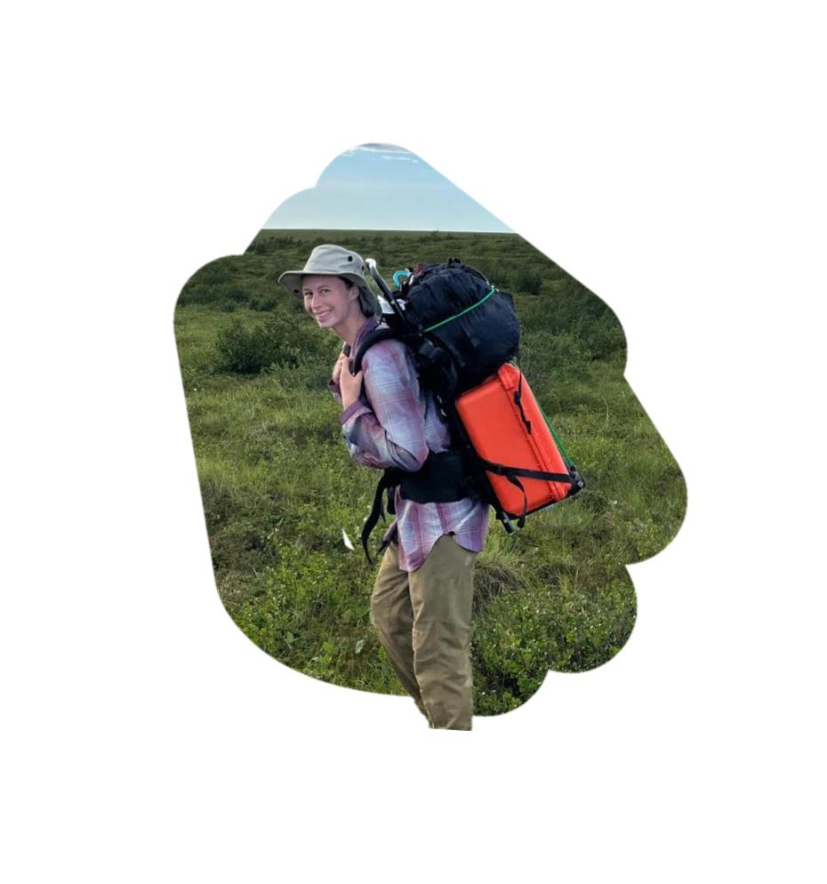

# Claire O'Brien
## Ecologist 

BSc from the University of British Columbia
MSc from Wilfrid Laurier University

### Hello!
My name is Claire, welcome to my webpage. I am an ecologist with experience in marine, estuarine, and terrestrial ecosystems. I lead field teams, design research projects, do data analysis, and write reports and papers. I am especially interested in climate change and disturbance impacts on species traits, species composition, and ecosystem function. 

## 

### What I am up to 
I am currently writing a paper to publish the data from my MSc thesis with the [FERG](https://forestecology.ca/). I am currently open to work.
